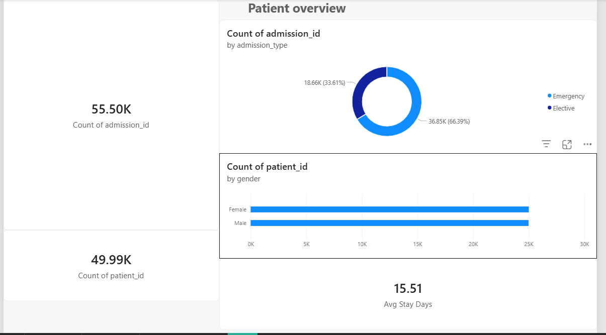
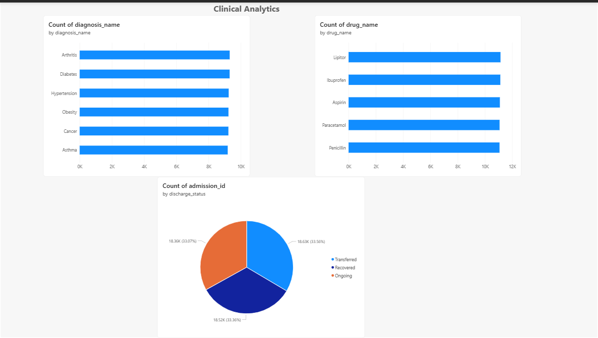
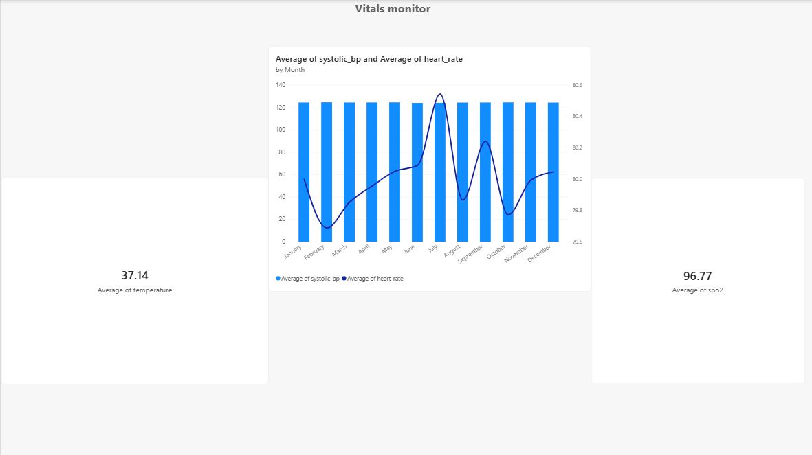
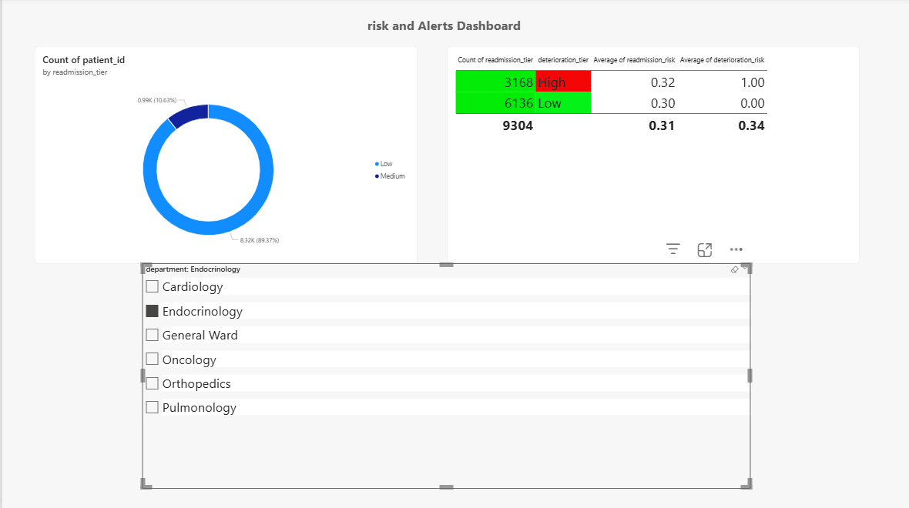

# Healthcare Analytics & Risk Prediction System
##  Folder Structure
healthcare_project/
├── healthcare_schema.sql   → PostgreSQL schema (8 tables)
├── healthcare_ml.py        → ML pipeline (Random Forest + SHAP)
├── healthcare_dataset.csv  → Kaggle data (55,500 rows)
├── load_data.py            → CSV → PostgreSQL loader
└── README.md               → This file
```
---

##  Step 1 — Install Python dependencies
Open terminal in VS Code and run:
```bash
pip install pandas sqlalchemy psycopg2-binary scikit-learn shap numpy
```
---

##  Step 2 — Set up PostgreSQL database
```bash
psql -U postgres
CREATE DATABASE healthcare_db;
\q
```
Then run the schema:
```bash
psql -U postgres -d healthcare_db -f healthcare_schema.sql
```

---

##  Step 3 — Update DB password
Open `load_data.py` and `healthcare_ml.py`, find this section and update your password:
```python
DB_CONFIG = {
    "host":     "localhost",
    "port":     5432,
    "database": "healthcare_db",
    "user":     "postgres",
    "password": "your_password"   # <-- change this
}
```

---

## Step 4 — Run the pipeline

### Load CSV data into SQL:
```bash
python load_data.py
```
Expected output:
```
Loading CSV...
  55500 rows loaded.
Inserting patients...
Inserting admissions...
Inserting diagnoses...
Inserting vitals...
Inserting lab results...
Inserting medications...
 All data loaded successfully!
```

### Train ML models & generate risk scores:
```bash
python healthcare_ml.py
```

---

##  What gets populated
| Table          | Source                        | Rows (~)  |
|----------------|-------------------------------|-----------|
| patients       | CSV names/age/gender          | 55,500    |
| admissions     | CSV admission/discharge dates | 55,500    |
| diagnoses      | CSV medical conditions + ICD  | 55,500    |
| vitals         | Generated (realistic ranges)  | 55,500    |
| lab_results    | Generated (per condition)     | ~220,000  |
| medications    | CSV medication column         | 55,500    |
| risk_scores    | ML model output               | 55,500    |

---

##  Next Steps
1. Connect Power BI to `healthcare_db`
2. Build dashboards using the `v_patient_risk_summary` view
3. Add Claude AI explanation layer to fill `ai_explanation` field
## Dashboard Preview

### Page 1


### Page 2


### Page 3


### Page 4

